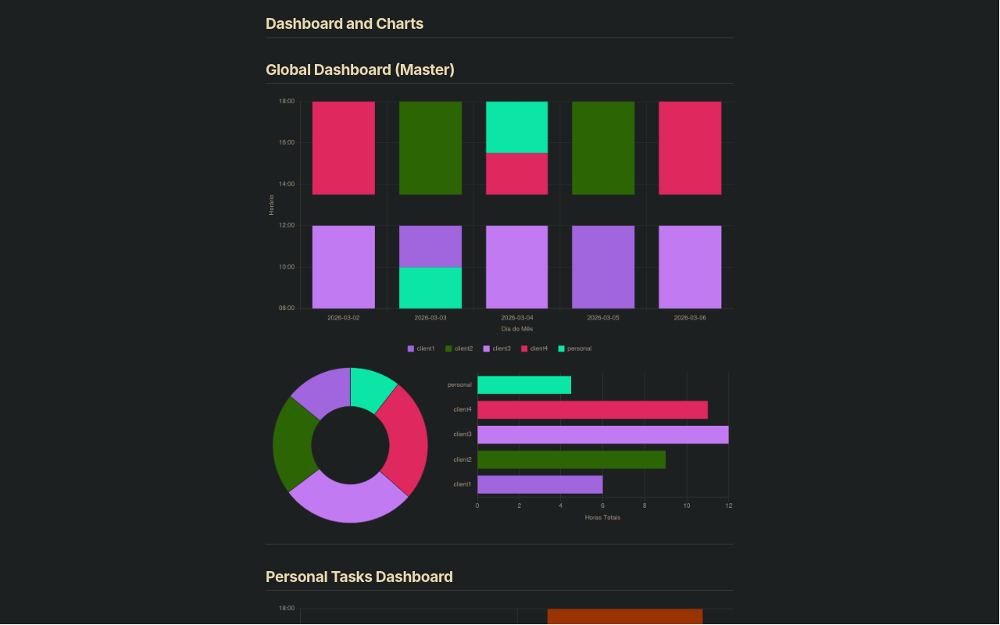

# Chrono-Org: A Suckless Time-Tracking & Dashboard Publishing Workflow

Welcome to **Chrono-Org**, an elegant, pure-text workflow that bridges the gap between Emacs Org-mode's unparalleled time-tracking capabilities and modern, interactive web dashboards. 

Built with the **K.I.S.S.** (Keep It Simple, Stupid) and **Suckless** philosophies in mind, this project treats Org-mode as the absolute source of truth. It extracts your logged hours using Emacs Lisp, generates static JSON data, renders beautiful Chart.js dashboards in the browser, and publishes everything securely via `org-publish` and Apache `.htaccess` rules.

## Screenchot


## 🏗️ Architecture: The 4 Pillars

The ecosystem relies on a closed, private, and lightweight architecture divided into four main engines:

1. **Source of Truth (Org-mode as Database):**
   The base is purely textual, segmented by context (e.g., `personal.org`, `client1.org`, `client2.org`). Each file manages its own lifecycle (TODO, INICIADO, DONE), properties, and precise time tracking via `LOGBOOK` and `CLOCK`.
   
2. **Extraction Engine (The Lisp ETL):**
   A silent Emacs Lisp routine acts as an Extract, Transform, Load (ETL) pipeline. It recursively scans the `.org` files, parses the task trees, sums the minutes in the `LOGBOOK`s, filters by status/tags, and outputs consolidated `.json` files into an `assets/data/` directory.

3. **Visualization Engine (Frontend JS):**
   Inside each `.org` file, literal HTML blocks (`#+BEGIN_EXPORT html`) inject `<canvas>` structures. Local JavaScript engines (`dashboard-local.js`, `dashboard-master.js`) run entirely client-side on the browser, consuming the generated JSONs to render interactive metrics (Timelines, Donuts, Top Tasks) based on `data-context` and `data-month` attributes.

4. **Publishing & Security Engine (org-publish + Apache):**
   The `org-publish` process orchestrates the final assembly. It transpiles the raw Org text to HTML preserving the directory tree, and pushes static assets to the production server. Directory-level access control is enforced via `.htaccess` files, dynamically injected into the publish configuration to keep client names private in public repositories.

---

## 📂 Directory Structure (Example)

```text
www/
├── assets/
│   ├── css/
│   │   └── style.css
│   ├── data/                 <-- Generated by the Lisp Extraction Engine
│   │   ├── global-dashboard-2026-03.json
│   │   └── index-2026-03-summary.json
│   └── js/
│       ├── chart.js
│       ├── dashboard-local.js
│       └── dashboard-master.js
├── index.org
├── .htaccess                 <-- Protects index but allows assets/
├── personal/
│   ├── personal.org
│   ├── .htaccess
│   ├── client3/
│   │   ├── client3.org
│   │   └── .htaccess
│   └── client4/
│       ├── client4.org
│       └── .htaccess
├── client1/
│   ├── client1.org
│   └── .htaccess             <-- Distinct htpasswd basic auth
└── client2/
    ├── client2.org
    └── .htaccess
```

---

## 🚀 Setup and Configuration

### 1. Emacs Configuration (`init.el`)

To orchestrate the workflow, you need to set up your agenda files, load the extraction engine, and configure the publishing parameters. Here is the canonical configuration:

```elisp
;; 1. Map Org-mode Agenda Files (Recursive search)
(setq org-agenda-files 
      (directory-files-recursively "~/Trabalho/Agenda/" "\\.org$"))

;;------------------------------------------
;; chrono-org :: Online Agenda Publisher
;;------------------------------------------

;; 2. Load the Extraction Engine (Lisp to JSON)
(load "~/src/chrono-org/publish/extraction-engine.el")

;; Define where the engine should look for data and the main context
(setq clock2json/agenda-files
      (directory-files-recursively "~/Trabalho/Agenda/" "\\.org$"))
(setq clock2json/agenda-main-context "personal")

;; 3. Load the Publishing Engine (org-publish wrapper)
(load "~/src/chrono-org/publish/chrono-org-publish.el")

;; 4. Define Security Files (.htaccess)
;; We use a variable so we don't hardcode client names in the org-publish-project-alist.
;; This list will be evaluated during the publish process using a backquote (`) injection.
(setq cop/agenda-security-files 
      '(".htaccess"
        "assets/.htaccess"
        "personal/.htaccess" 
        "client1/.htaccess" 
        "client2/.htaccess"))
;;-----------------------------------------
```

*(Note: Ensure your `org-publish-project-alist` within `chrono-org-publish.el` uses backquotes ``` ` ``` and unquotes `,` to evaluate the `cop/agenda-security-files` into the `:include` property of the static components. This bypasses the default org-publish behavior of ignoring hidden files).*

### 2. Apache & Security Configuration

Because you are likely sharing specific directories with specific clients (e.g., `client1` sees only `client1.org`'s output), we rely on Apache's `htpasswd` and `.htaccess`.

1. **Create outside-of-webroot password files:**
   ```bash
   sudo htpasswd -c /etc/httpd/.passwd-agenda-personal my_user
   sudo htpasswd -c /etc/httpd/.passwd-agenda-client1 client1_user
   ```

2. **Configure Directory `.htaccess`:**
   Place an `.htaccess` inside each specific directory. Example for `client1/.htaccess`:
   ```apache
   AuthType Basic
   AuthName "Client Portal - Client 1"
   AuthUserFile /etc/httpd/.passwd-agenda-client1
   Require valid-user
   ```

3. **Public Assets Exception:**
   To ensure charts render correctly, your `assets/.htaccess` must override parent locks:
   ```apache
   Require all granted
   Satisfy Any
   ```

---

## ⚙️ Workflow & Daily Usage

1. **Clock In / Clock Out:**
   Start your day. Navigate to your tasks in your `.org` files and use standard `C-c C-x C-i` (clock-in) and `C-c C-x C-o` (clock-out). 
   
2. **Execute the Extraction Engine:**
   Run the loaded Elisp extraction function (e.g., `M-x clock2json/extract-all`). This will quietly parse all `LOGBOOK` entries and generate the contextual JSON files inside `assets/data/`.

3. **Publish to Web:**
   Run the org-publish command (`C-c C-e P p`). Emacs will transpile the `.org` files to `.html`, copy the `.htaccess` files (maintaining security boundaries), and push the updated JSONs to your server.

4. **Review:**
   Navigate to your Apache-hosted URL. The embedded JavaScript will fetch the new JSONs and instantly update your client-facing dashboards.

---

## 🛠️ Modding & Extending

The beauty of this workflow is its **modularity**. 
- Want a new chart type? Just edit `dashboard-local.js` and push. 
- Got a new client? Add a directory, create an `.htaccess`, drop in an `.org` file with an HTML export block, update your `cop/agenda-security-files` variable, and publish.

No complex Node.js build pipelines, no heavy databases. Just pure text, robust Lisp, and standard web technologies.

## 🤝 Community

This project was built to showcase the power of Emacs as a complete lifecycle management tool. If you adapt this workflow, feel free to share your dashboards and Lisp tweaks on the [r/emacs](https://www.reddit.com/r/emacs/) subreddit!
